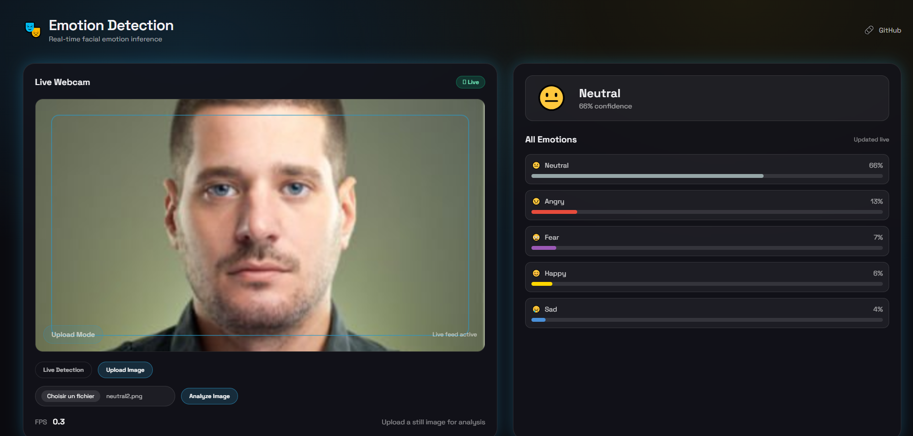
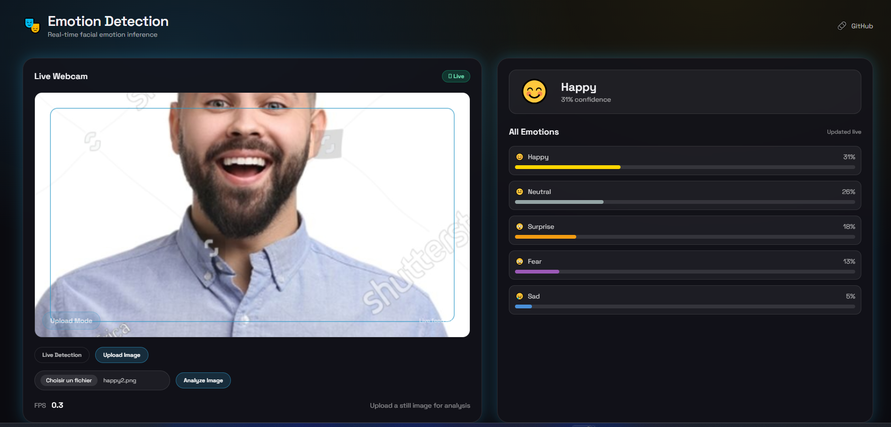

<div align="center">

# 🎭 Real-Time Emotion Detection

**A full-stack web app that captures webcam frames, runs facial emotion recognition via HuggingFace, and renders live predictions with confidence scores — all in real time.**


</div>

---

## ✨ Features

- 📷 **Live webcam capture** — frames streamed directly from the browser
- 🤖 **HuggingFace inference** — powered by [`dima806/facial_emotions_image_detection`](https://huggingface.co/dima806/facial_emotions_image_detection)
- 📊 **Confidence scores** — real-time probability breakdown per emotion class
- ⚡ **Fast & lightweight** — React + Vite frontend, FastAPI async backend

---

## 🖼️ Screenshots
 


---

## 🛠️ Tech Stack

| Layer | Technology |
|---|---|
| **Backend** | FastAPI, Hugging Face Inference API, Pillow |
| **Frontend** | React, Vite, Tailwind CSS |
| **Model** | `dima806/facial_emotions_image_detection` |

---

## 🚀 Getting Started

### Prerequisites

- Python 3.9+
- Node.js 18+
- A [Hugging Face API token](https://huggingface.co/settings/tokens)

### Backend

```bash
cd backend
python -m venv .venv

# Activate (Linux/macOS)
source .venv/bin/activate
# Activate (Windows PowerShell)
.venv\Scripts\Activate.ps1

pip install -r requirements.txt

# Set your HuggingFace token
export HF_API_TOKEN="your_token"          # Linux/macOS
$env:HF_API_TOKEN="your_token"            # Windows PowerShell

uvicorn main:app --reload --host 0.0.0.0 --port 8000
```

### Frontend

```bash
cd frontend
npm install
npm run dev
```

Open [http://localhost:5173](http://localhost:5173) in your browser.

---

## 📁 Project Structure

```
├── backend/
│   ├── main.py
│   └── requirements.txt
├── frontend/
│   ├── src/
│   └── package.json
└── README.md
```

---

## 📄 License

MIT